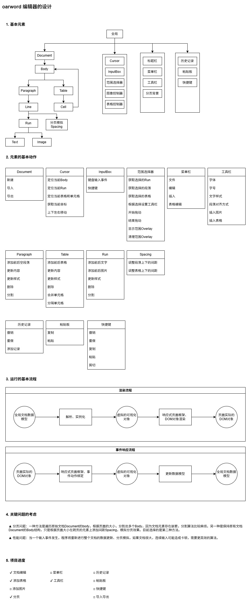

[2026.7.3] :bowtie:**添加了设计文档**

# oarword2


## Project setup
```
yarn install
```

### Compiles and hot-reloads for development
```
yarn run serve
```

### Compiles and minifies for production
```
yarn run build
```

## Design and Progress

